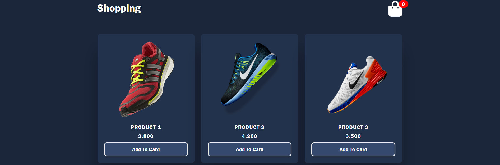

# 🛒 Shoe Store - Shopping Cart Web App

A modern and interactive **Shoe Store Shopping Cart Application** built using **HTML, CSS, and JavaScript**.

---

## 📌 Overview

Shoe Store allows users to browse shoes, add them to the cart, update quantities, and remove items with a smooth, interactive interface:

- 🏷️ **Product Listing** – Browse items with images and prices  
- ➕ **Add to Cart** – Add products with one click  
- 🔼 **Quantity Control** – Increase or decrease item quantity  
- 🗑 **Remove Items** – Remove single items or clear the entire cart  
- 🧮 **Cart Summary** – View total price and item count in real-time  
- 🎨 **Responsive UI** – Works on desktop and tablet screens  

---

## 🛠️ Tech Stack

- **HTML5** 🌐  
- **CSS3** 🎨  
- **JavaScript (ES6+)** ⚡  
- **Font Awesome** 🎯  

---

## ✨ Features

- 🌈 Modern and clean UI  
- 🛍️ Dynamic cart updates  
- 🧩 Simple and beginner-friendly code  

---

## 🎥 **Preview**
  
  
  
---

